# Vinyl Record Collection 
Simple CRUD app using PHP and MongoDb. Working example of using a LAMP server connected to a MongoDb server. I used Bootstrap v4.0.0 as a front-end, utilizing a 3rd party plug-in ([DataTables](https://datatables.net/)) to stylize and control the functions of the various HTML tables used. This app is a simple vinyl record inventory system.

This README has been written to address setting up this project in [Codio](https://www.codio.com) for [FAMU](http://www.famu.edu/index.cfm?cis). If you have a lamp server with a MongoDb server set up, AND you have connected PHP to MongoDb, then feel free to use this as-is.

## Set Up in Codio
Once you log in to Codio.com and navigate to your dashboard, click on Stack (under BUILD). Here you will see two stacks available to you. The type of stack we want is a basic LAMP stack with MongoDb installed in parallel. Click on the FAMU CIS/mongo apache php stack.

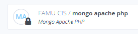

Click on the Use button.

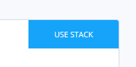

Give your project a name and (optional) description, set it as public or private, then click the Create button.

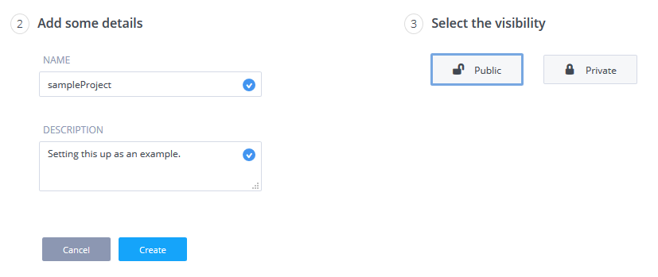

Now we have the environment set up, we need the project files, you have two choices in accomplishing this. You can clone the project into the working directory using git or manually create each directory and upload all the files into codio (since codio doesn't allow an easy way to upload full directories). 
If you want to use Git, go skip ahead to **Clone Project Files with Git** section. 
If you have to manually upload the files skip down to the **Manually Upload Project Files** section.

### Clone Project Files with Git <--- THIS IS THE RECOMMENDED PROCESS
Open a Terminal and enter the following command

    git clone https://github.com/EricMayberryIV/phpMongo.git .
    
Skip down to the **Create the Database** Section

### Manually Upload Project Files
In the top menu, click File then Upload

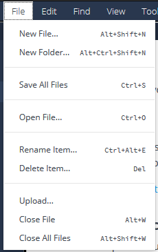

Delete the README.md file if you want to use this readme in your project. Click the BROWSE FOR FILES... button. Find and select all of the project files, click open to upload the files.

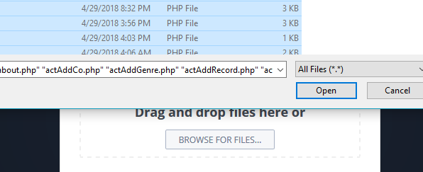

You need to create the directories then upload their contents from your local machine. Codio does support drag and drop so this should help ease the pain of this step a little. Once you are done, the project should look something like this.

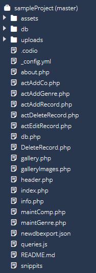

## Create the Database
Open a Terminal and open Mongo and create and load the database. Use the following commands
    
    mongo recColl 
    load('db/import/company.js')
    load('db/import/genre.js')
    load('db/import/vinyl.js')

## Enjoy the Application

### Add a Genre to the Database
On the top navigation bar click Maintenance then click Genre

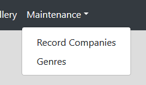

Click the Add button

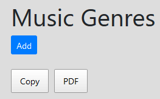

Fill in a new genre name and an optional note, then click Add

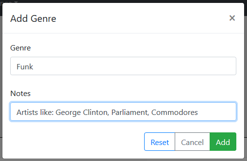

You will be navigated back to the Genre page, here is where you can find the new genre.

### Add a Record Company to the Database
On the top navigation bar click Maintenance then click Record Companies

Click the Add button

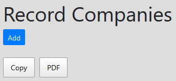

Fill in a new label name and an optional note, then click Add

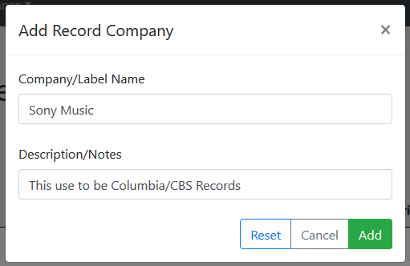

You will be navigated back to the Company page, here is where you can find the new company.

### Add a Record to the Database
On the top navigation bar click Record Collection. 

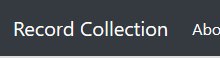

Click the Add button

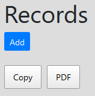

Fill in the form with as much information as you have available. If you would like, you have a choice to upload album art. Click Add

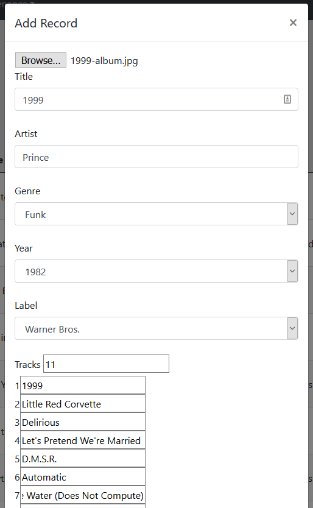

You will be navigated back to the Record (home) page, here is where you can find the new record.

### Find Record
Click in the Search box and search for any information in any field and the search will find it.
Example searching for "for"

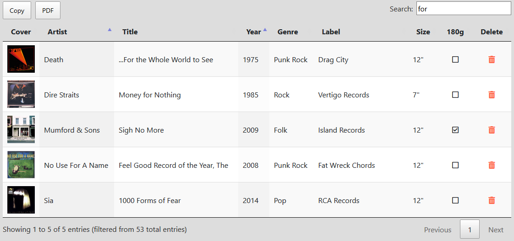

### View Record Information
On the home page, click on the album art for a record. You will be navigated to the info page, here is an example of the record that I just uploaded. If the record has tracks and/or members associated with it you can expand those sections.

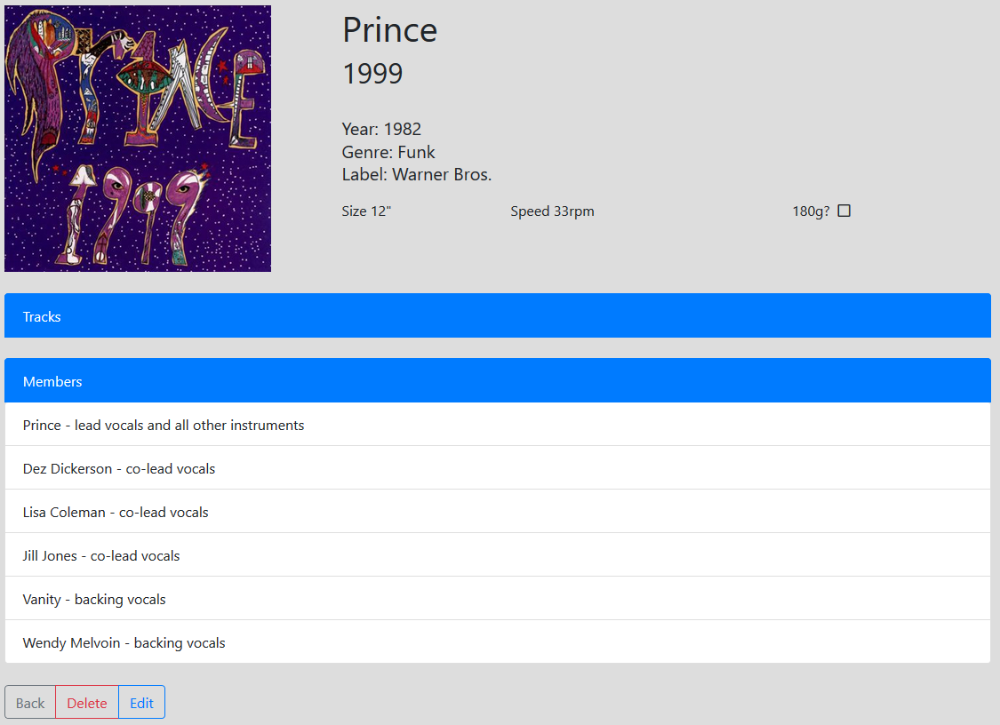

### Edit a Record
Click on the Edit button on the info page for a record, you can update the information then click the Edit button and the page will refresh with the updated data.

### Delete a Record
You can either click the trash can on the Record (home) table or click the Delete button on the info page to delete a record. You will be sent to a confirmation screen where you can cancel or fully delete the record.

### View the Gallery
On the top navigation bar click Gallery

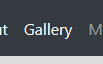

This page shows you a grid of the uploaded album art. The grid will update every 8 seconds and redisplay in a random order. The images can be clicked to visit the info page for the record. As is the rest of the application, this page is responsive and can handle a variety of screen sizes.

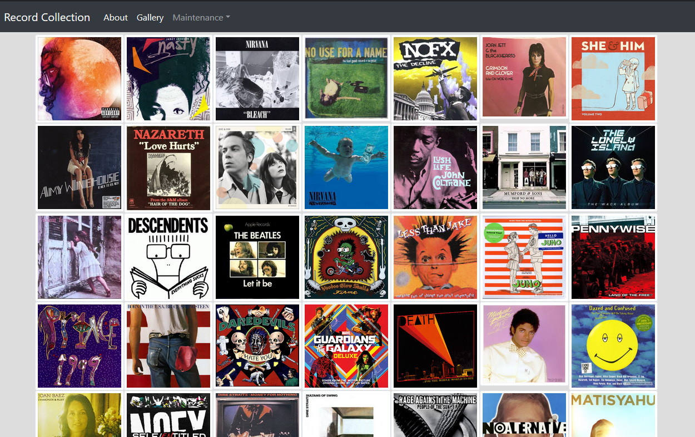